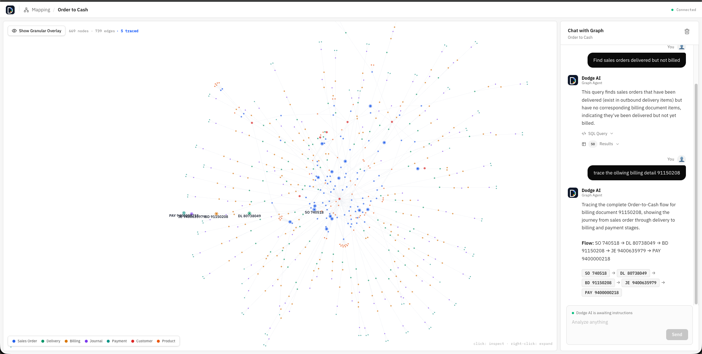
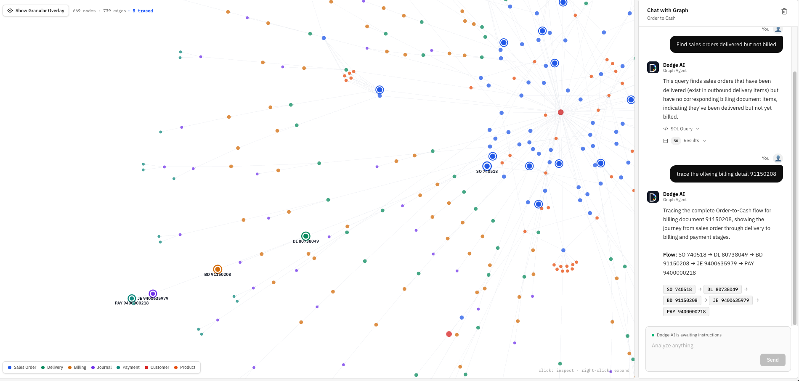

# Dodge AI — SAP Order-to-Cash Context Graph

A full-stack application that ingests SAP Order-to-Cash (O2C) data, constructs an interactive graph of business entities, and provides a conversational AI interface for querying relationships using natural language.


### Graph Visualization + Chat Query Interface



### Document Flow Tracing with Node Highlighting



## Architecture

```
┌─────────────────────────────────────────────────────┐
│                    Frontend (React)                  │
│  ┌──────────────┐  ┌────────────────────────────┐   │
│  │  Graph Panel  │  │       Chat Panel            │   │
│  │  ForceGraph2D │  │  NL → Backend → SQL → Data │   │
│  │  Node Detail  │  │  Trace Flow Visualization  │   │
│  └──────────────┘  └────────────────────────────┘   │
│         Zustand State │ shadcn/ui │ Tailwind CSS     │
└───────────────────────┬─────────────────────────────┘
                        │ REST API
┌───────────────────────┴─────────────────────────────┐
│                   Backend (FastAPI)                   │
│  ┌─────────┐ ┌───────────┐ ┌──────────────────────┐ │
│  │ Graph   │ │ Chat      │ │ LLM Service          │ │
│  │ Service │ │ Router    │ │ (Claude Sonnet)      │ │
│  │ + Trace │ │ + Guards  │ │ NL→SQL + Tool Calls  │ │
│  └─────────┘ └───────────┘ └──────────────────────┘ │
│         SQL Executor │ Guardrails │ Prompts           │
└───────────────────────┬─────────────────────────────┘
                        │
              ┌─────────┴─────────┐
              │    PostgreSQL      │
              │  19 tables, ~21K  │
              │    rows (JSONL)   │
              └───────────────────┘
```

## Key Decisions

### Database: PostgreSQL

Chose PostgreSQL over SQLite for production readiness, concurrent connections, and proper deployment support. The dataset is small (~21K rows across 19 tables) but PostgreSQL demonstrates real architectural thinking. All columns stored as TEXT matching the source JSONL schema, with indexes on every foreign key column for fast JOINs.

### Graph Model

7 primary node types derived from the O2C flow:

| Node Type | Source Table | Count |
|---|---|---|
| SalesOrder | sales_order_headers | 100 |
| Delivery | outbound_delivery_headers | 86 |
| BillingDocument | billing_document_headers | 163 |
| JournalEntry | journal_entry_items_accounts_receivable | ~90 |
| Payment | payments_accounts_receivable | ~60 |
| BusinessPartner | business_partners | 8 |
| Product | products | 69 |

6 edge types computed from foreign key relationships:
- **DELIVERED_VIA**: Sales Order → Delivery (via `outbound_delivery_items.referenceSdDocument`)
- **BILLED_VIA**: Sales Order/Delivery → Billing Document (via `billing_document_items.referenceSdDocument`)
- **ACCOUNTED_IN**: Billing Document → Journal Entry (via `accountingDocument`)
- **PAID_VIA**: Journal Entry → Payment (via `clearingAccountingDocument`)
- **SOLD_TO**: Sales Order → Business Partner (via `soldToParty`)
- **CONTAINS_PRODUCT**: Sales Order → Product (via `sales_order_items.material`)

Graph is computed on-the-fly from SQL JOINs, not stored in a separate graph database. At this scale (~669 nodes, ~739 edges), queries return in <10ms.

### LLM Integration: Claude Sonnet

Uses a Claude API proxy with the OpenAI-compatible chat completions format. The system prompt includes:

1. Full database DDL schema
2. Key relationship map between tables
3. PostgreSQL-specific rules (quoted identifiers for camelCase columns)
4. Sample data values for context
5. Tool definition for document flow tracing

The LLM returns structured JSON responses in one of three formats:
- `{sql, explanation}` for data queries
- `{tool: "trace", doc_id}` for flow tracing
- `{off_topic: true}` for rejected queries

### Guardrails (3 Layers)

1. **Keyword pre-filter** — Regex-based check rejects obviously off-topic queries (poems, weather, recipes) before hitting the LLM, saving API calls
2. **LLM-level instruction** — System prompt explicitly instructs rejection of non-O2C queries with a structured JSON response
3. **SQL validation** — Whitelist `SELECT` and `WITH` (CTEs) only. Blocks `DROP`, `DELETE`, `INSERT`, `ALTER`, etc. Enforces `LIMIT 50`, 10-second timeout via PostgreSQL `statement_timeout`

### Document Flow Tracing

When users ask to trace a document, the LLM triggers the `trace` tool instead of generating SQL. The backend `trace_service` walks the O2C chain bidirectionally:
- **Upstream**: Billing → Delivery → Sales Order
- **Downstream**: Sales Order → Delivery → Billing → Journal → Payment

The traced nodes are highlighted on the graph with auto-zoom-to-fit.

## Tech Stack

| Layer | Technology |
|---|---|
| Backend | Python, FastAPI, uvicorn |
| Database | PostgreSQL 16 (Docker) |
| LLM | Claude Sonnet (via API proxy) |
| Frontend | React 18, TypeScript, Vite |
| UI Components | shadcn/ui, Tailwind CSS v4 |
| Graph | react-force-graph-2d (d3-force) |
| State | Zustand (with localStorage persistence) |
| Icons | Lucide React |
| Font | IBM Plex Sans / Mono |

## Project Structure

```
dodge/
├── app/
│   ├── config.py                 Environment configuration
│   ├── main.py                   FastAPI app, CORS, lifespan
│   ├── database.py               PostgreSQL connection, ingestion, queries
│   ├── models.py                 Pydantic response models
│   ├── routers/
│   │   ├── graph.py              /api/graph/* endpoints
│   │   └── chat.py               /api/chat/query endpoint
│   ├── services/
│   │   ├── prompts.py            LLM system prompt template
│   │   ├── llm_service.py        Claude API client
│   │   ├── guardrails.py         Off-topic detection
│   │   ├── sql_executor.py       Safe SQL validation + execution
│   │   └── trace_service.py      O2C document flow tracing
│   └── utils/
│       ├── data_loader.py        JSONL → PostgreSQL bulk ingestion
│       └── response_parser.py    LLM JSON response extraction
├── frontend/
│   └── src/
│       ├── api/client.ts          API types + fetch functions
│       ├── store/
│       │   ├── graphStore.ts      Graph state (Zustand)
│       │   └── chatStore.ts       Chat state with persistence
│       ├── hooks/
│       │   └── useHighlightedNodes.ts
│       ├── components/
│       │   ├── Breadcrumb.tsx
│       │   ├── GraphPanel.tsx     Force-directed graph
│       │   ├── ChatPanel.tsx      Chat interface
│       │   ├── NodeDetail.tsx     Entity inspector
│       │   ├── Logo.tsx           SVG logo component
│       │   └── ui/               shadcn components
│       ├── App.tsx                Root layout (responsive)
│       ├── main.tsx
│       └── index.css              Tailwind + theme
├── data/                          JSONL dataset (gitignored)
├── docker-compose.yml             PostgreSQL container
├── requirements.txt               Python dependencies
├── .env.example                   Environment template
└── README.md
```

## API Endpoints

| Method | Path | Description |
|---|---|---|
| GET | `/api/health` | Health check with table counts |
| GET | `/api/graph/overview` | Full graph (669 nodes, 739 edges) |
| GET | `/api/graph/node/{id}` | Node metadata + connection count |
| GET | `/api/graph/expand/{id}` | Expand node children (items, products) |
| GET | `/api/graph/trace/{doc_id}` | Trace O2C flow for a document |
| POST | `/api/chat/query` | Natural language query |

## Setup

### Prerequisites

- Docker (for PostgreSQL)
- Python 3.11+
- Node.js 18+

### Backend

```bash
docker compose up -d

python3 -m venv venv
source venv/bin/activate
pip install -r requirements.txt

cp .env.example .env
# Edit .env with your LLM API key

uvicorn app.main:app --reload
```

### Frontend

```bash
cd frontend
npm install
npm run dev
```

Open http://localhost:5173

## Example Queries

- "How many sales orders are there?"
- "Which products have the most billing documents?"
- "Trace the flow of billing document 91150187"
- "Find sales orders that were delivered but not billed"
- "Show all business partners"
- "What is the total net amount across all sales orders?"
- "What about deliveries?" _(follow-up with conversation memory)_

## Features

- Interactive force-directed graph with 669 nodes and 739 edges
- Click to inspect node metadata, right-click to expand related entities
- Natural language to SQL translation via Claude Sonnet
- Document flow tracing with graph highlighting and auto-zoom
- 3-layer guardrails (keyword filter, LLM instruction, SQL validation)
- Conversation memory (localStorage persistence)
- Responsive layout with mobile tab navigation
- Copy SQL queries to clipboard
- Collapsible SQL and data table views
